# ViTrack Frontend

ViTrack is a modern employee attendance tracking system designed to simplify and replace traditional time-tracking hardware. Employees can easily check in and check out using their mobile devices by capturing a live photo and sharing their location. Managers can monitor attendance, analyze behavior, and access statistics in real time.

The system significantly improves operational efficiency and reduces manual tracking efforts by up to 85%.

---

## Backend Repository

Frontend works together with the backend API:

👉 [https://github.com/Eljav04/ViTrackAPI](https://github.com/Eljav04/ViTrackAPI)

---

## Note

Due to confidentiality of real employee data, all screenshots below are manually created examples.

The system itself is already in production and actively used by a real company.

---

## Admin Panel

### Dashboard

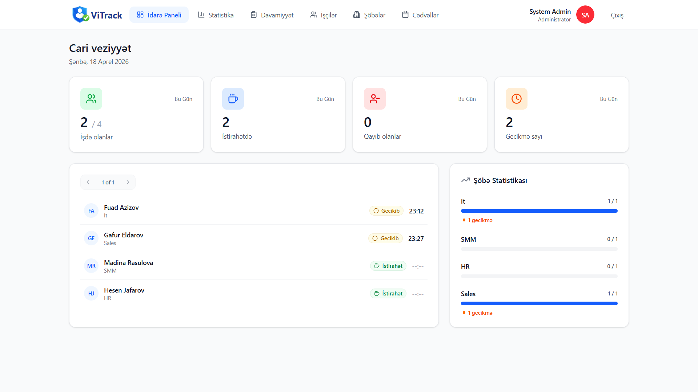

Displays overall daily status: who arrived, who is late, absent, or on rest. Also shows quick statistics and department-level insights.

---

### Statistics

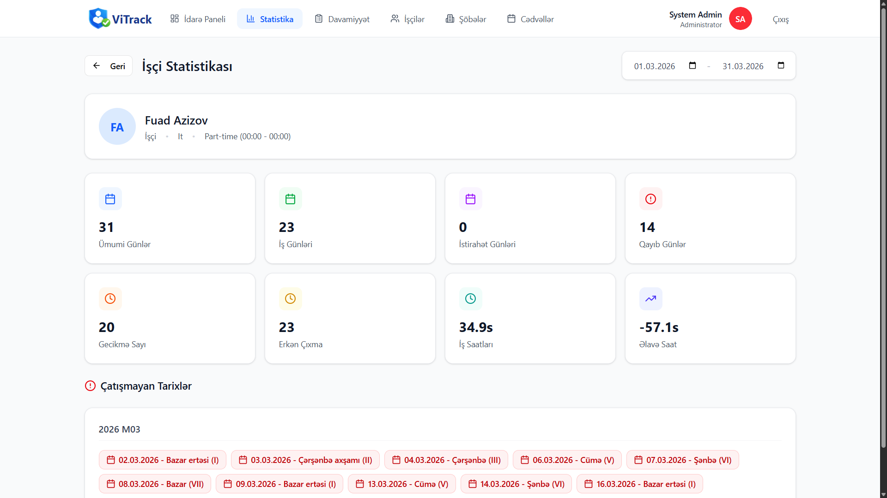

Allows viewing employee statistics for any selected period.

---

### Attendance & Details

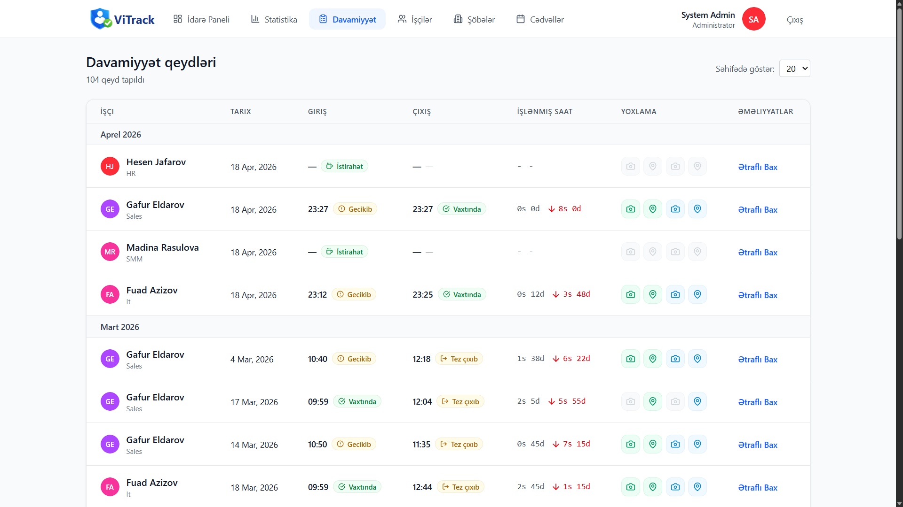

Main table with backend-powered pagination and filtering.
Provides a full overview at a glance:

* arrival / leave times
* late / on-time status
* overtime / undertime
* photo presence
* location tracking

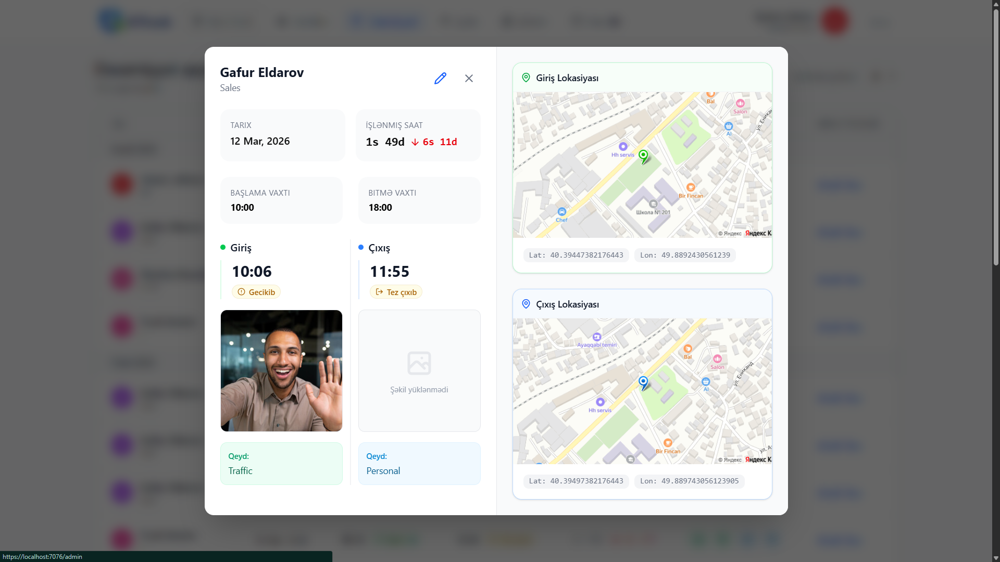

Detailed view of a specific record:

* exact timestamps
* map location
* employee photo
* comments and notes

---

### Users Management

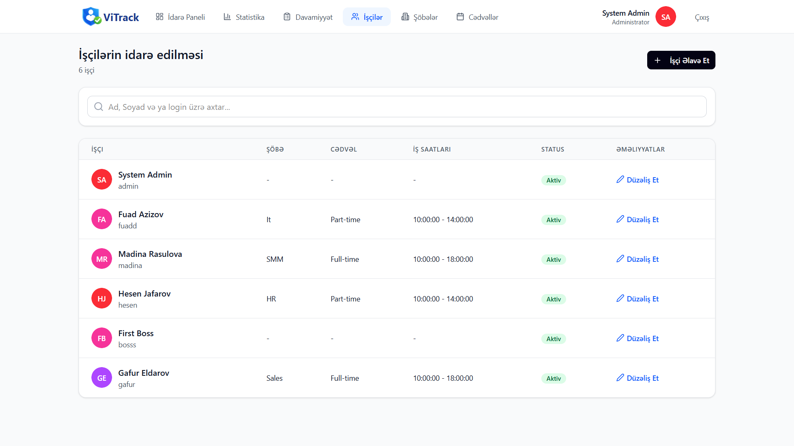

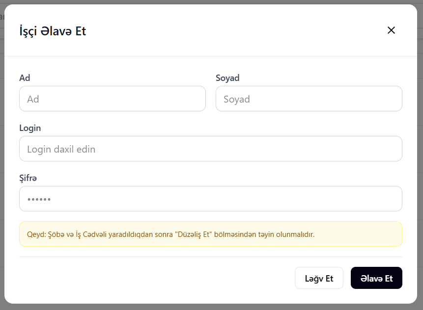 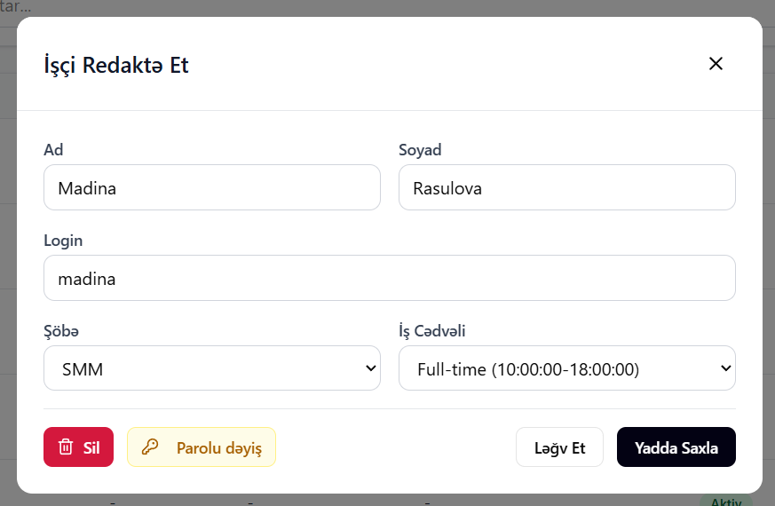

Admins can create, edit, and manage employees.

---

### Departments

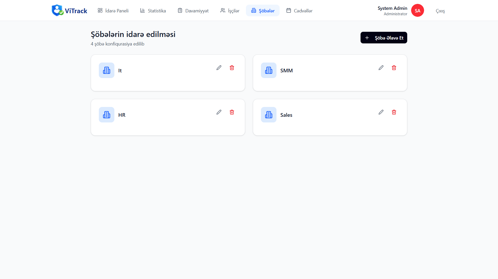

Manage company departments.

---

### Work Schedules

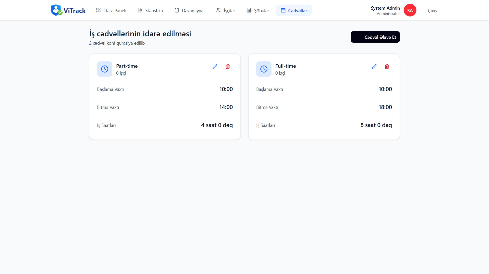

Configure working hours and schedules.

---

## Employee Panel

### Main Screen

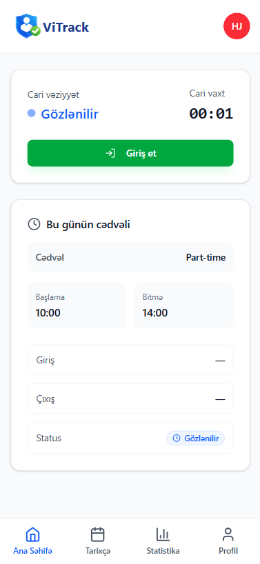

Employee can choose to check in, check out, or mark a rest day.

---

### Check-in Process

.png)
.png)
.png)
.png)
.png)

Process:

* choose action (arrival / rest)
* confirm location
* take a live photo (uploading is not allowed to prevent fraud)
* optionally add a comment (e.g., late reason)

---

### History

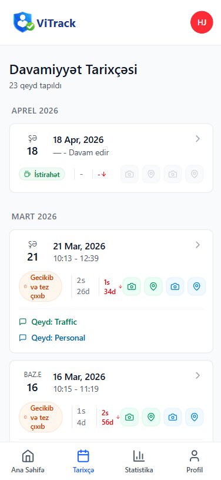

Employees can view their attendance history.

---

### Statistics

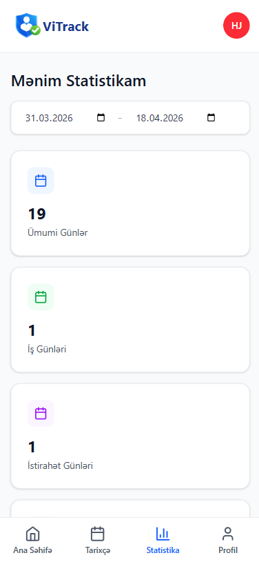

Basic statistics similar to admin view.

---

### Profile

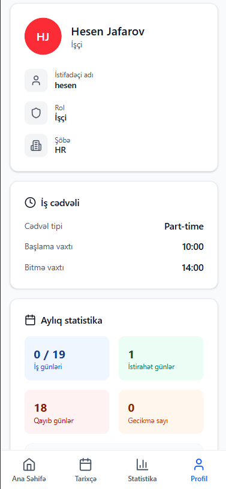

Displays personal info and current month stats. Includes logout option.

---

## Architecture Overview

The frontend is built using React with a clean and scalable structure.

### Main Stack

* React (TypeScript)
* State management (custom store)
* Modular component architecture
* API service layer abstraction

---

## Project Structure

```
src/
 ├── assets/        # images and README resources
 ├── components/    # reusable UI components
 │    ├── admin/
 │    ├── employee/
 │    ├── ui/
 ├── pages/         # route-level pages
 ├── services/      # API calls
 ├── store/         # state management
 ├── lib/           # helpers and utilities
 ├── styles/        # global styles
 ├── data/          # static/mock data
 ├── App.tsx
 ├── main.tsx
```

---

## Additional Notes

* All UI/UX design, frontend, backend, and deployment were fully developed and managed by me.
* The system is designed to scale and replace traditional attendance hardware solutions.
* Backend-driven pagination and filtering ensure performance even with large datasets.
